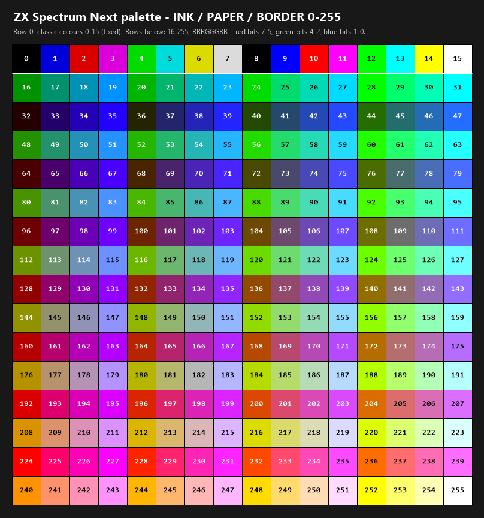

# Colours

`INK n`, `PAPER n` and `BORDER n` take any value from 0 to 255. The
compiler already checks all three against that full range - they are
declared as a generic value parameter, not a colour-specific one - so
nothing needed to change there; only what the interpreter does with the
upper part of the range is new.

## Colour chart



Row 0 is the classic block, 0-15. Every row after it is the extended
range, 16-255, left to right in numeric order - read a cell's number
straight into `INK`, `PAPER` or `BORDER`.

**0 to 15 are the classic Spectrum colours**, unchanged: 0 to 7 are the
eight ULA colours in the usual `INK`/`PAPER` order, and 8 to 15 are the
same eight again, bright.

**16 to 255 are the standard Next colour of that same number** - the
`RRRGGGBB` byte convention already used for [location
art](graphics.md) and Gfx2Next: bits 7-5 are red, bits 4-2 are green,
and bits 1-0 are blue. It is one mental model for pictures and text
alike - whatever a number means to Gfx2Next, it means the same thing
here.

There is no palette file to supply, and none is needed. Every one of
the 256 standard Next colours is already addressable by its own number,
so `INK`, `PAPER` and `BORDER` simply reach further into the same fixed
palette [location art](graphics.md) draws from - there is nothing to
load, generate or ship alongside your database.

## Working out a colour from its number

For any `n` from 16 to 255:

```
red   = (n >> 5) & 7      -- 0-7
green = (n >> 2) & 7      -- 0-7
blue  =  n       & 3      -- 0-3
```

or build a number from the three components the other way round:

```
n = red*32 + green*4 + blue
```

A few worked examples: 224 is full red (`7,0,0`), 28 is full green
(`0,7,0`), and 255 is white (`7,7,3`, the maximum of everything). 3
works out to pure blue by the same arithmetic, but 3 is inside 0 to 15,
so it reads as the classic colour it already was rather than as blue -
every value below 16 keeps its classic meaning regardless of what the
`RRRGGGBB` arithmetic would say about that same byte; only 16 and above
are decoded this way.

Because blue only has two bits, the same thing is true of every pure
blue: with red and green both 0, the value never climbs past 3, so a
saturated blue with no red or green in it is always a classic colour
(1, or 9 for bright), never one from the extended range. Add a touch of
red or green and the value moves above 15, with a matching shift in the
resulting hue.

If you would rather see the numbers than compute them, the
[colour chart](#colour-chart) above is exactly this palette, indexed.
Any paint or sprite tool that lets you pick from the Next's standard
RGB332 palette - the same one described under [Custom mouse
pointer](mouse.md#custom-mouse-pointer) - previews colour `n` at index
`n` too, since it is the identical 256-colour palette `INK`,
`PAPER` and `BORDER` draw from.

One value is reserved: `PAPER 227` makes the paper transparent rather
than magenta, because 227 is `#FF00FF`, the transparent colour
throughout NextDAAD; `INK 227` likewise makes the glyph shapes
transparent; `BORDER 227` is unaffected and renders magenta; and any
other colour that would land on the transparent value is shifted one
step up the green scale, which is why colour 11 renders as a very
slightly different magenta.
